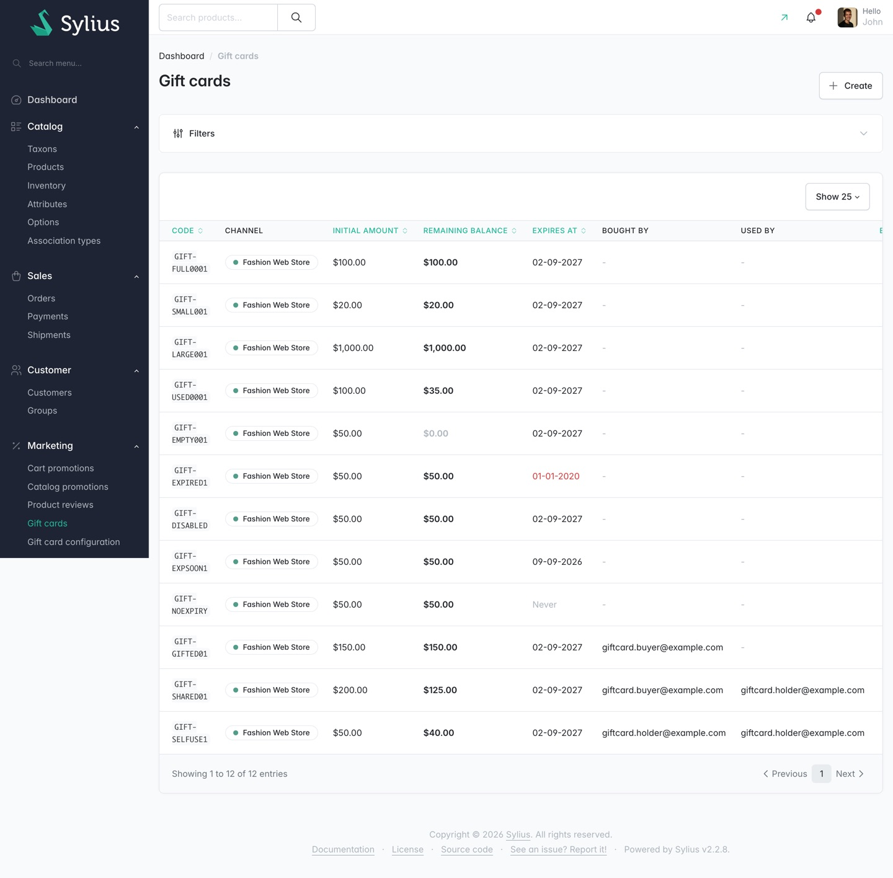

# Gift card plugin user guide

This guide covers the gift card plugin as an operator and a customer meet it: the screens in the
Sylius admin, the fields on the shop pages, and what the plugin does with a card once a code is
entered.

It does not cover installing the plugin. For that, read
[`docs/INSTALLATION.md`](../INSTALLATION.md). For the reasoning behind the design, read the
[ADR log](../adr-log/). For a condensed operator-level summary of behaviour, read
[`docs/USAGE.md`](../USAGE.md).

## The one thing to get right

**A gift card is money, not a discount.**

The order stays worth what the goods are worth. The card comes off what the customer has to pay.
A 100 order paid with a 40 gift card is still a 100 order, and the customer pays 60.

That is not a wording preference. Tax is owed on the value of the goods, reporting and refunds see
the real sale value, and a "spend over X" promotion cannot be switched off by paying with a card.
See [ADR 0010](../adr-log/0010-gift-card-as-tender.md).

Every screen that shows a customer or an operator what is owed carries two numbers:

| Line | What it is |
|---|---|
| **Order total** | The value of the goods. Gift cards never change it. |
| **Gift cards** | What the applied cards cover, shown as a negative figure. |
| **Left to pay** | What the customer is actually charged. |

## Features

| Guide | Covers |
|---|---|
| [Gift card configuration](features/gift-card-configuration.md) | Per-channel setup: code format, validity, whether cards are sold, how a customer picks the amount. |
| [Managing gift cards in the admin](features/managing-gift-cards.md) | The **Gift cards** list, issuing a card by hand, the card page, balance history and balance adjustments. |
| [Selling gift cards](features/selling-gift-cards.md) | Marking a product as a gift card, the amount and message a customer chooses, and what happens when the order is paid or cancelled. |
| [Redeeming a gift card](features/redeeming-a-gift-card.md) | The redeem panel on the cart and in checkout, stacking, refusals, rate limiting, and what an operator sees on the order. |
| [My gift cards in the customer account](features/customer-account.md) | The two lists a customer sees, and the per-card balance history. |

## Journeys

**None of the journeys below were replayed against a running app.** The development server stopped
responding before the journey capture ran, so there are no journey screenshots and no recorded step
results. Each walkthrough is written from the plugin's routes, controllers, forms and templates, and
every one of them says so at the top. Treat them as instructions to follow, not as evidence that the
flow was observed working.

| Journey | Who it is for |
|---|---|
| [Set up gift cards for a channel](journeys/set-up-gift-cards-for-a-channel.md) | Operator setting the shop up. |
| [Issue a gift card from the admin](journeys/issue-a-gift-card-from-the-admin.md) | Administrator handing out goodwill or compensation. |
| [Correct a gift card's balance](journeys/correct-a-gift-cards-balance.md) | Administrator handling a customer query. |
| [Spend a gift card on an order](journeys/spend-a-gift-card-on-an-order.md) | Customer holding a gift card. |
| [Apply a gift card during checkout](journeys/apply-a-gift-card-during-checkout.md) | Customer part-way through checkout. |

## Reference

| Page | Covers |
|---|---|
| [Forms reference](reference/forms.md) | Every field on every gift card form, with its help text and validation messages. |
| [Empty states](reference/empty-states.md) | What each screen shows when there is nothing to show. |
| [Accessibility notes](reference/accessibility.md) | What the crawl measured on the plugin's screens, and the two rendering faults it found. |

## Where things are in the admin

The plugin adds two entries under **Marketing**: **Gift cards** and **Gift card configuration**.

## Words this guide uses

- **Gift card**, never "voucher" and never "coupon".
- **Purchaser** ("Bought by"): the customer who paid for the card.
- **Redeemer** ("Used by"): the first customer to apply the card to an order.
- **Balance history**: the append-only ledger of every movement on a card.

## What is not covered here

- Installation, entity wiring, route imports and rate limiter configuration:
  [`docs/INSTALLATION.md`](../INSTALLATION.md).
- Design decisions and their trade-offs: the [ADR log](../adr-log/).
- PDF gift cards, API Platform resources and bulk generation are not in 1.0. See
  [ADR 0009](../adr-log/0009-no-pdf-in-1-0.md).
