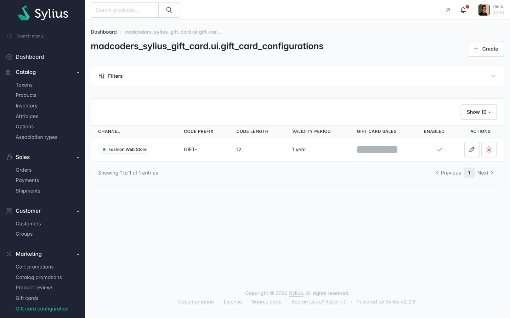

# Gift card configuration

Gift cards are scoped to a channel. A card issued in one channel cannot be spent in another, so its
face value cannot change currency or store behind your back.

Each channel gets one configuration, under **Marketing > Gift card configuration**.

A channel with no configuration still works. The model defaults apply: 16 random characters, no
prefix, one year of validity, gift cards sold in the shop at the product's price.

## The list

The list has one row per channel and these columns:

| Column | Shows |
|---|---|
| **Channel** | The channel this configuration applies to. |
| **Code prefix** | What is put in front of every generated code. |
| **Code length** | How many random characters follow the prefix. |
| **Validity period** | How long a new card stays valid. |
| **Gift card sales** | Whether customers may buy gift cards in this channel. |
| **Enabled** | Whether the configuration is in use. |
| **Actions** | Edit and delete. |

There is no read-only view of a configuration. The row's only actions are the pencil (edit) and the
bin (delete) icons; selecting the pencil opens the same form used to create one.

**Known fault:** the **Gift card sales** cell renders as a blank grey pill. The value is there in
the page, but the badge sets a background colour without a matching text colour, so the label is
invisible against it. You can read the value by opening the configuration for editing. See
[Accessibility notes](../reference/accessibility.md).

Filter the list by **Channel**. That is the only filter.

## Creating or editing a configuration

Select **Create**, or the pencil on an existing row. The full field list, with help text and
validation messages, is in the [forms reference](../reference/forms.md#gift-card-configuration).

### Codes

**Code prefix** is put in front of every generated code, for example `GIFT-`. It is optional.

**Code length** is the number of random characters after the prefix. The minimum is 12. Enter
anything lower and the form refuses it with "The code length must be at least 12 characters - a
shorter code is guessable." The model also raises a shorter value to 12 on its own, so no channel
can end up issuing guessable codes even if it is configured from code rather than from this form.

Generated codes come from a cryptographically secure source and skip the characters people misread
off a card or an email: `0`/`O`, `1`/`I`/`L`, `5`/`S`.

### Validity

**Validity period** is a relative date expression such as `1 year` or `6 months`, applied when a
card is created. It is required, and it cannot be left empty: every gift card expires. A shop that
wants cards to last effectively forever sets a long period, such as `25 years`, which keeps the
liability dated and reportable rather than open-ended. See
[ADR 0015](../../adr-log/0015-every-gift-card-expires.md).

### What a gift card is allowed to pay for

**What a gift card pays for** decides whether stored value may be spent on another gift card.

- **Everything except gift cards** (the default) - a card pays for goods, and a basket of nothing
  but gift cards is refused.
- **Anything, gift cards included** - no restriction.

The default is not arbitrary. Letting a card buy a card lets a holder move a balance into a fresh
code with a fresh expiry date, indefinitely, and breaks the link back to whoever originally bought
it. See [ADR 0016](../../adr-log/0016-a-gift-card-does-not-buy-a-gift-card.md) and the journey
[Why a gift card will not pay for a gift card](../journeys/why-a-gift-card-will-not-pay-for-a-gift-card.md).

### Whether the channel sells gift cards

**Gift card sales** has two choices:

| Choice | Effect |
|---|---|
| **Sold in the shop** | Customers can buy gift card products in this channel. This is the default, and the behaviour of a channel with no configuration. |
| **Issued by an administrator only** | Customers cannot buy gift card products in this channel. |

Choosing **Issued by an administrator only** refuses the purchase at three points: adding a gift
card product to the cart, completing checkout with one already in the cart, and issuing cards when
an order is paid. The first two show the customer an error; the third only ever fires if something
bypassed checkout validation, and it writes a warning to the log naming the order.

**Redeeming is not affected by this setting.** A card an administrator issued is spendable in the
shop exactly as a bought one is, in either mode. The gift card flag stays on the product, so
switching back to **Sold in the shop** resumes selling.

The rough edge: in **Issued by an administrator only** mode the add-to-cart button on a gift card
product still renders, and still renders enabled. The customer's first feedback is an error after
clicking it, not a control that was never offered. This is documented as a known limitation in
[ADR 0013](../../adr-log/0013-gift-card-sale-mode.md).

### How the customer picks the amount

**How the amount is chosen** has four choices:

| Choice | What the customer sees on the product page |
|---|---|
| **The product's price** | Nothing to choose. The card is worth the product's channel price. |
| **A list of preset amounts** | The channel's presets, as radio buttons. Nothing else is accepted. |
| **Any amount within a range** | A money box to type an amount, with the bounds shown under it. |
| **Preset amounts, or any amount within a range** | The presets, plus an **Other amount** radio and a box. |

**Preset amounts** is a comma-separated list in the channel's currency, entered in major units, for
example `25, 50, 100`. It is required by the two preset modes.

**Smallest amount** and **Largest amount** bound what a customer may type. Both are required by the
two free-amount modes, and the largest cannot be smaller than the smallest. Preset amounts are
offered whether or not they fall inside those bounds.

The form refuses a configuration that offers a choice it cannot honour:

- a preset mode with no presets: "This mode offers preset amounts, so at least one has to be set."
- a free-amount mode missing a bound: "This mode lets the customer type an amount, so both the
  smallest and the largest have to be set."
- inverted bounds: "The largest amount cannot be smaller than the smallest one."

The money fields show no currency symbol. The channel decides the currency, and this form does not
know which channel you will pick until you pick it.

Amounts are re-checked on the server on every order recalculation, not only when the form is
submitted. A request that never went near the product page cannot buy a 500 card for a penny. See
[ADR 0014](../../adr-log/0014-customer-chosen-gift-card-amount.md).

### Enabled

**Enabled** controls whether this configuration is in use.

## What is not shown here

The gift card configuration list heading and breadcrumb currently render the raw translation key
`madcoders_sylius_gift_card.ui.gift_card_configurations` instead of a title. The screenshot above
shows this. It is a missing translation, not a setting.
