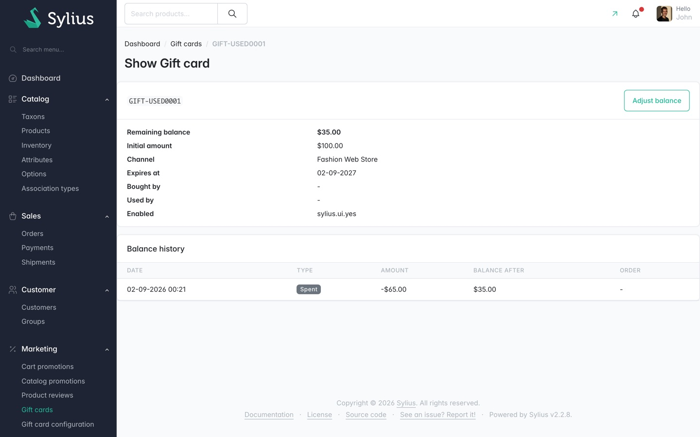

# Managing gift cards in the admin

**Marketing > Gift cards** is where you browse cards, issue one by hand, read a card's history and
correct a balance.

## The list

Columns, in order: **Code**, **Channel**, **Initial amount**, **Remaining balance**, **Expires at**,
**Bought by**, **Used by**, **Enabled**, **Creation date**, **Actions**.

At a 1440px window the last three columns sit past the right edge of the table and need horizontal
scrolling to reach. The row's link into the card page is in the **Actions** column, labelled
**details**.

How the list renders values:

- **Remaining balance** is bold, and greyed once the card is spent out. `GIFT-EMPTY001` at `$0.00`
  in the screenshot is greyed.
- **Expires at** is red when the card has already expired. `GIFT-EXPIRED1` at `01-01-2020` is red.
  A card with no expiry shows **Never**.
- **Bought by** and **Used by** show the customer's email address, or `-` when there is no link.

Cards default to newest first. **Code**, **Initial amount**, **Remaining balance**, **Expires at**,
**Enabled** and **Creation date** are sortable. Page size is 25, 50 or 100 through the **Show 25**
control.

**Filters** offers three: **Code** (text), **Channel** and **Enabled**.

## Issuing a card by hand

Select **Create**. This is the path for goodwill, compensation, or importing pre-printed cards.

Only **Channel** and **Initial amount** have to be filled in. Everything else is derived or
optional:

- **Code** - leave empty and the channel's configuration generates one. Enter one explicitly to
  import a pre-printed card.
- **Expires at** - leave empty to use the channel's configured validity period.
- **Custom message** - free text, shown with the code wherever the card appears.
- **Enabled** - ticked by default.
- **Initial amount** - required. The currency comes from the channel, so the box shows no symbol.

Then select **Create**. **Back** returns to the list without saving.

Field-by-field detail is in the [forms reference](../reference/forms.md#new-gift-card).

Note the field order: **Initial amount** is rendered last, below the **Enabled** checkbox, because
it is added to the form only while the card is new.

## The card page

Selecting **details** on a row opens **Show Gift card**.

The header carries the code and an **Adjust balance** button. Below it:

| Row | Notes |
|---|---|
| **Remaining balance** | What is left on the card. Emphasised, because it is the number you are looking for. |
| **Initial amount** | What the card was worth when it was issued. |
| **Channel** | The channel the card belongs to and can be spent in. |
| **Expires at** | The expiry date, or **Never**. |
| **Bought by** | The purchaser's email, or `-`. |
| **Used by** | The redeemer's email, or `-`. |
| **Enabled** | Whether the card can be applied to an order. |
| **Custom message** | Only shown when the card has one. Rendered as text, never as markup. |

**Known fault:** the **Enabled** row currently renders the raw translation key `sylius.ui.yes`
instead of "Yes". Both screenshots on this page show it. Read the card's enabled state from the
list, or from the edit form.

### Balance history

Every movement on the card is recorded, newest last, so the card reads as a story.

| Column | Shows |
|---|---|
| **Date** | When the movement happened. |
| **Type** | **Spent** or **Added**. |
| **Amount** | Signed: `-$65.00` for a debit, `+` for a credit. |
| **Balance after** | What the card was worth once the movement was applied. |
| **Order** | The order number that caused it, or `-` for a manual adjustment. |

A card that has never moved shows "This gift card has not been used yet." instead of the table.

Balance history is what answers "where did my balance go?" without reconstructing it from order
adjustments. Redemptions, cancellations and manual adjustments all land here.

## Adjusting a balance

Select **Adjust balance** on the card page. Use it for a goodwill top-up, or to claw back a card
issued in error.

The page shows the card's current balance over its initial amount, then two fields:

- **Direction** - radio buttons, **Add to balance** or **Take from balance**. **Add to balance** is
  preselected.
- **Amount** - always positive. The direction is what decides the sign, so a stray minus sign
  cannot turn a top-up into a deduction.

Select **Adjust balance** to apply it, or **Cancel** to go back to the card. A successful adjustment
flashes "The gift card balance has been adjusted." and adds an entry to the balance history with no
order number.

This page was not reached by the documentation crawl, so there is no screenshot of it. The fields
above are read from the form definition, not from a captured page.

## Editing a card

The row's pencil icon opens the edit form. Two fields behave differently once a card exists:

- **Code** is shown but disabled, with the help text "A code cannot be changed once the card is
  issued - the customer already has it, and orders paid with the card are linked to it."
- **Initial amount** is not on the form at all. A card's face value must not move under orders that
  already reference it. Use **Adjust balance** for corrections.

**Channel**, **Expires at**, **Custom message** and **Enabled** stay editable.

## Disabling rather than deleting

Cancelling an order that issued gift cards disables those cards rather than deleting them, so their
history survives and you can reinstate them by ticking **Enabled** again.

## What an operator cannot do here

- There is no bulk generation and no PDF output in 1.0. See
  [ADR 0009](../../adr-log/0009-no-pdf-in-1-0.md).
- There is no way to see a code a customer has typed but not successfully applied. Failed redemption
  attempts are counted, never logged with the code.
