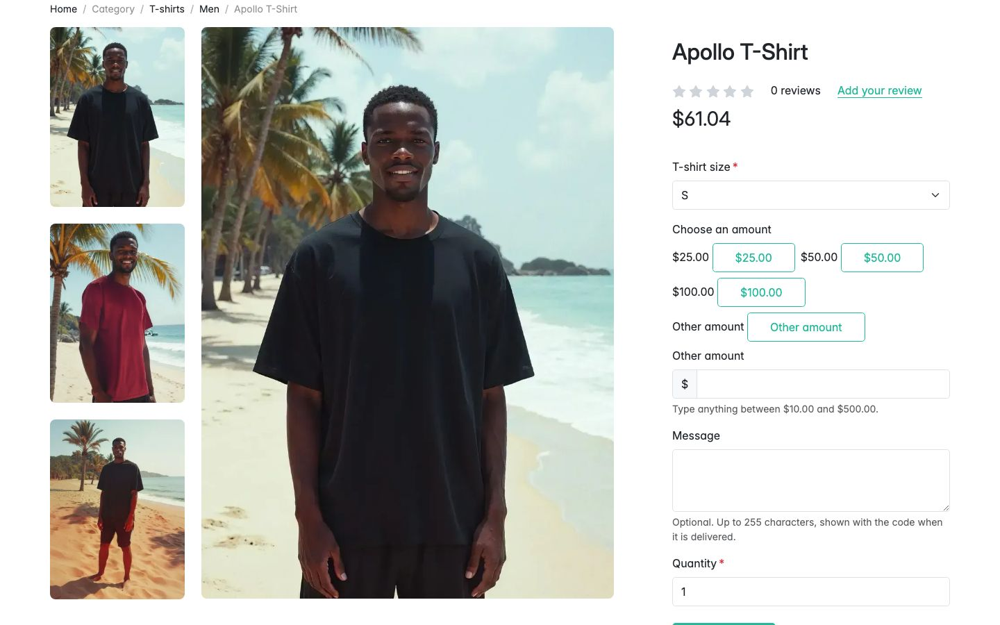
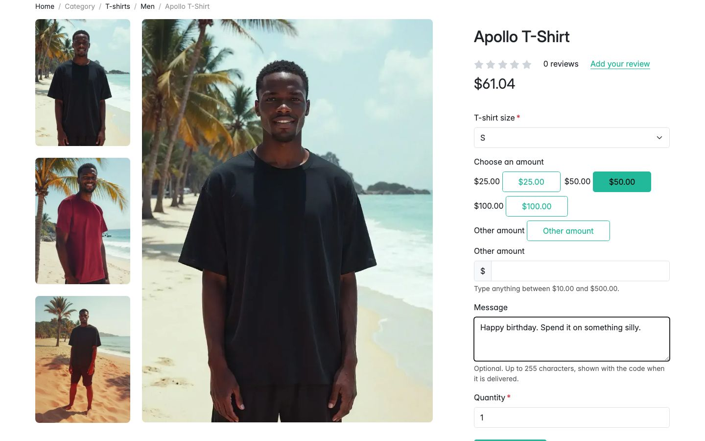
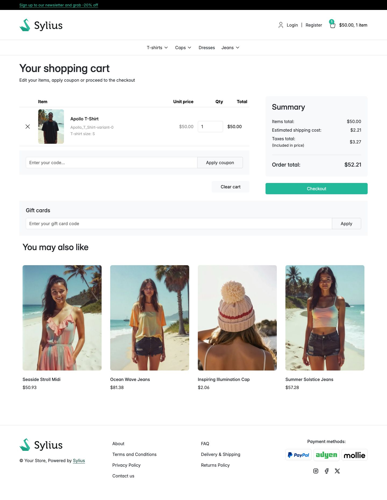

# Journey: buy a gift card as a guest

> **Replayed against a running shop on 2 September 2026.** Every screenshot below was taken while
> these steps were carried out, in order. Steps described without a picture were run but not
> photographed.

**Who:** someone with no account.
**Goal:** choose what a gift card is worth and write a message with it.
**Before you start:** the channel sells gift cards, and the product you open is marked as a gift
card.

The card in this walkthrough is sold through an ordinary product, **Apollo T-Shirt** in the demo
data. There is no separate gift card catalogue.

## 1. Start as a guest

No account is needed. Nothing on this page is behind a login.

## 2. Open a gift card product

The page looks like any other product page until you reach the add-to-cart form.

## 3. Read what the shop is offering

The shop decides which amounts it offers, and whether you may type your own. Two extra fields sit
between the variant selector and **Quantity**:

- **Choose an amount**, with one button per preset. This channel offers **$25.00**, **$50.00** and
  **$100.00**.
- **Other amount**, when the channel allows a typed amount. The box under it reads "Type anything
  between $10.00 and $500.00."
- **Message**, with "Optional. Up to 255 characters, shown with the code when it is delivered."

The product's own price, **$61.04** here, is what the product costs when it is not a gift card. It
is not what you will pay. See
[Selling gift cards](../features/selling-gift-cards.md#the-amount) for what each amount mode looks
like.

## 4. Choose what the card should be worth

Select one of the amounts, or select **Other amount** and type a figure inside the stated range.

## 5. Add a message for whoever receives it

The chosen amount is highlighted, and **Message** holds the text that will travel with the code.
The message is optional, and it is offered even on a fixed-price card.

## 6. Add it to your basket

Select the add-to-cart button. The shop confirms with "Item has been added to cart" and takes you to
the basket.

## 7. Check the basket

The basket charges the amount you chose, not the product's price. The line shows a unit price of
**$50.00**, and **Items total** is $50.00, not the $61.04 on the product page.

Shipping and tax are worked out on that figure like any other line: **Estimated shipping cost**
$2.21, **Taxes total** $3.27 included in the price, **Order total** $52.21.

## What happens next

Nothing spendable exists yet. The code is issued when the **order is paid**, one card per purchased
unit, and it is emailed to whoever bought it. See
[The email that carries the code](the-gift-card-email.md).

## A card cannot pay for itself

The **Gift cards** panel is on this page, but it will not accept a code while the basket holds only
gift cards. See
[Why a gift card will not pay for a gift card](why-a-gift-card-will-not-pay-for-a-gift-card.md).

## Related

- [Selling gift cards](../features/selling-gift-cards.md)
- [Buy a gift card while signed in](buy-a-gift-card-while-signed-in.md)
