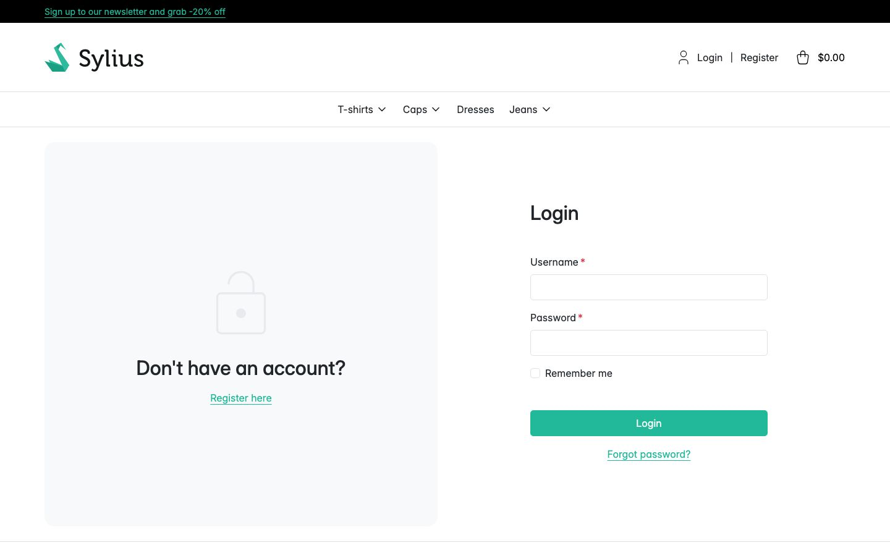
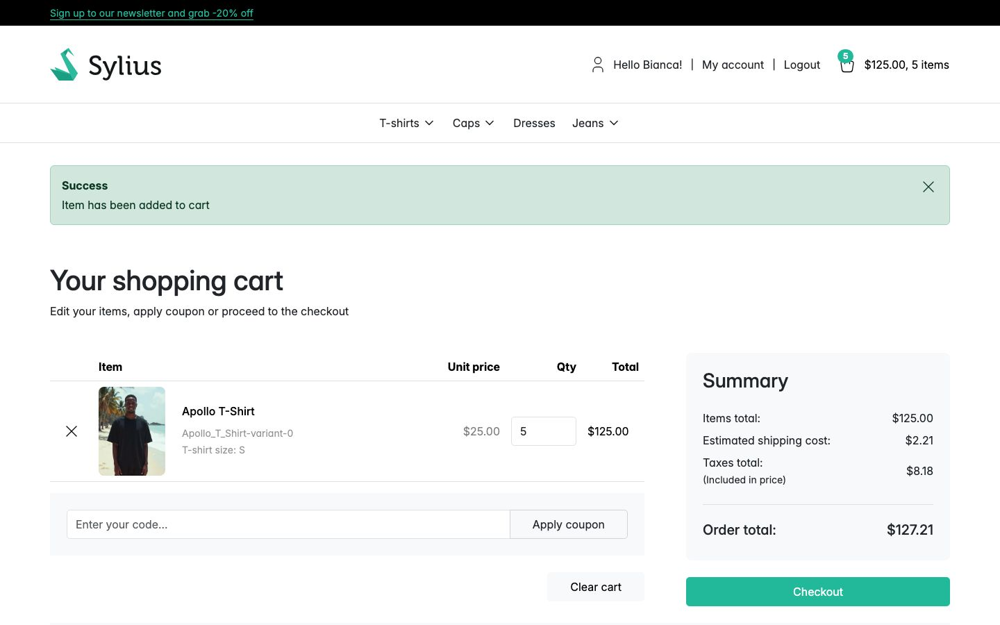
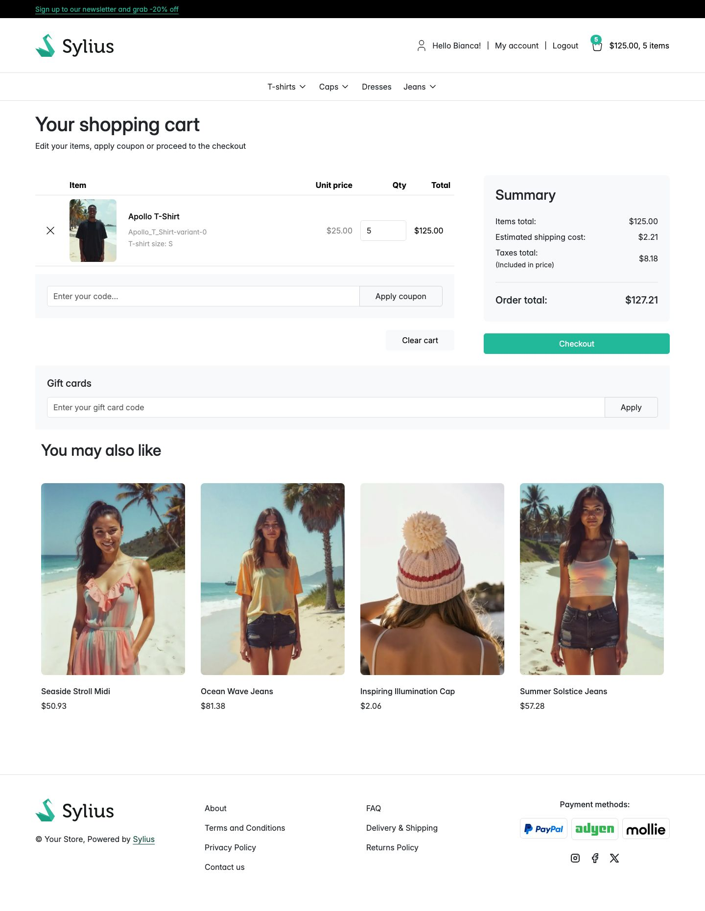

# Journey: buy a gift card while signed in

> **Replayed against a running shop on 2 September 2026.** Every screenshot below was taken while
> these steps were carried out, in order. Steps described without a picture were run but not
> photographed.

**Who:** a registered customer.
**Goal:** buy a card and have the shop record you as the person who bought it.
**Before you start:** you have an account in this channel.

Buying signed in works exactly like [buying as a guest](buy-a-gift-card-as-a-guest.md). The
difference is what the shop can do afterwards: it knows who paid, so it records you as the card's
**purchaser** and lists the card under **Gift cards I bought** in your account.

## 1. Sign in

Open **Login**. The form asks for **Username** (your email address) and **Password**, both required.
**Remember me** and **Forgot password?** are the standard Sylius controls; the plugin adds nothing
here.

Fill both fields and select **Login**. You are returned to the homepage, greeted by name.

## 2. Open a gift card product

The product page is the same page a guest sees. Being signed in changes nothing about the amount
options or the message box.

## 3. Choose an amount

This run chose **$25.00**.

## 4. Add it to your basket

The shop confirms with "Item has been added to cart".

## 5. Check the basket

The basket carries the amount you chose: the unit price is **$25.00**, not the product's $61.04.

The quantity in this capture is **5**, and **Items total** is $125.00. A signed-in basket is saved
against the account and survives between visits, so earlier runs of this walkthrough are still in
it. One card is issued **per unit**, so this basket would issue five separate codes of $25.00 each.

## What happens next

The codes are issued when the order is **paid**, and emailed to you. Because you were signed in, you
are recorded as each card's **purchaser** ("Bought by" in the admin), and each card appears under
**Gift cards I bought** in your account. See
[See your gift cards and where the balance went](see-your-gift-cards.md).

Buying a card does not make you its **redeemer**. That is recorded for the first customer to apply
the card to an order, which may well be somebody else.

## Related

- [Buy a gift card as a guest](buy-a-gift-card-as-a-guest.md)
- [Selling gift cards](../features/selling-gift-cards.md)
- [My gift cards in the customer account](../features/customer-account.md)
