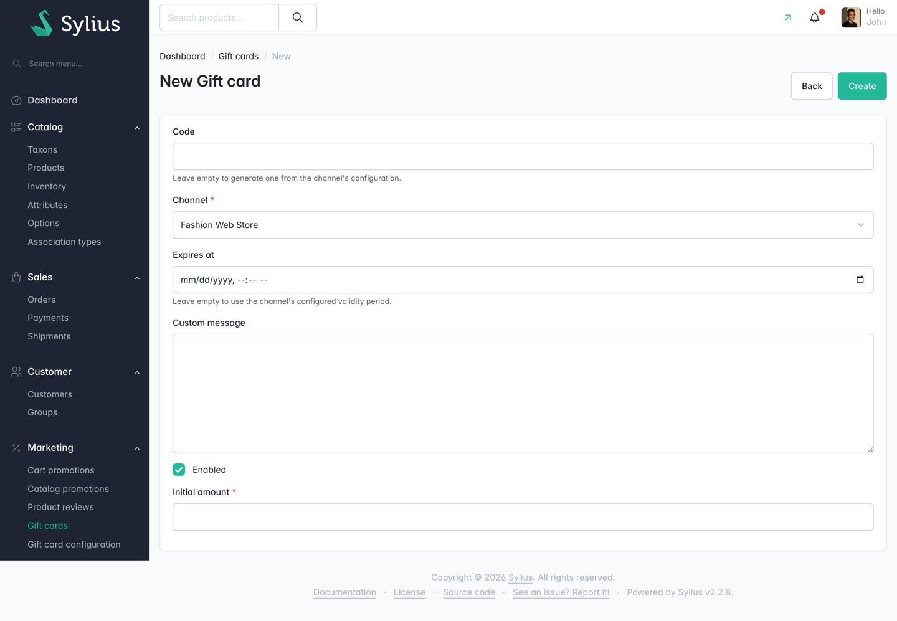
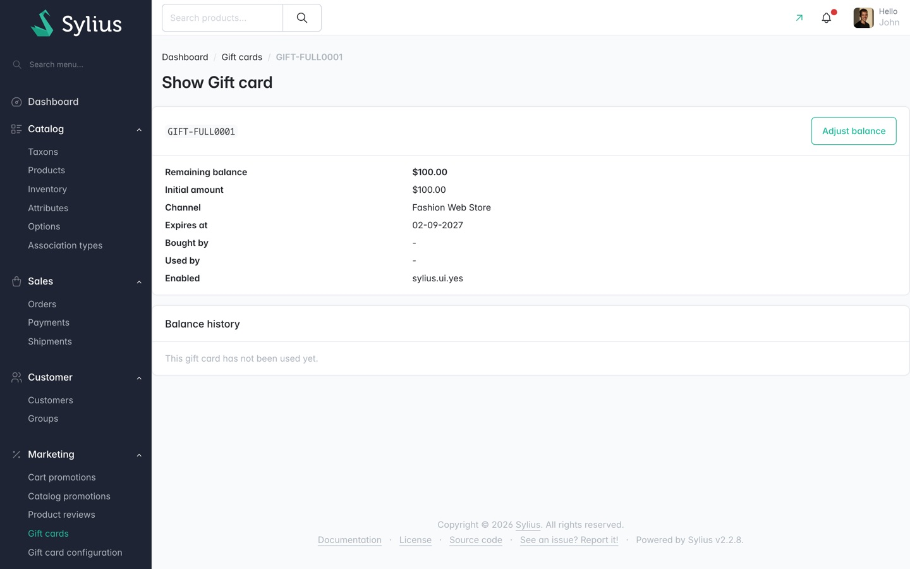

# Journey: issue a gift card from the admin

> **Not replayed.** These steps were never run against a running shop, so this walkthrough has no
> journey screenshots and no recorded step results. It is written from the plugin's routes, form
> definitions and templates. The screenshots below are admin pages the crawl captured on their own;
> the result of submitting the form was never observed.

**Who:** a shop administrator.
**Goal:** create a gift card without a customer buying one, for goodwill or compensation.
**Before you start:** the channel has a
[gift card configuration](../features/gift-card-configuration.md), or you are happy with the model
defaults.

## 1. Open Marketing > Gift cards

Captured page.

## 2. Select Create

Captured page. Note the field order: **Initial amount** is last, below the **Enabled** checkbox.

## 3. Leave Code empty

The channel's configuration generates a code: its prefix, then the configured number of random
characters. Fill **Code** in only when you are importing a pre-printed card.

## 4. Pick the Channel

Required. The card can only be spent in this channel, and this is where its currency comes from.

## 5. Leave Expires at empty

The channel's **Validity period** decides the expiry. Set a date here only when this particular card
should expire on a different day.

## 6. Optionally write a Custom message

Free text, shown with the code wherever the card appears.

## 7. Leave Enabled ticked

An unticked card cannot be applied to an order.

## 8. Enter the Initial amount

Required, and in the channel's currency. The box shows no currency symbol.

## 9. Select Create

## What you should see afterwards

The new card at the top of the list, since the list is sorted newest first. It should show your
generated code, the channel, the initial amount as both **Initial amount** and **Remaining
balance**, and an expiry date derived from the channel's validity period. **Bought by** and **Used
by** are both `-`: nobody paid for this card and nobody has spent it.

Opening it with **details** shows an empty **Balance history** reading "This gift card has not been
used yet."

Captured page, showing an existing card in that state rather than the one you just made.

## If something goes wrong

| What you see | What it means |
|---|---|
| "Please enter the amount the gift card is worth." | **Initial amount** was left empty. |
| "The amount must be greater than zero." | **Initial amount** was zero or negative. |
| "A gift card with this code already exists." | You typed a **Code** that is already in use. Clear it to have one generated. |

## Afterwards

The card's **Initial amount** cannot be changed. If you get it wrong, correct it with
[Correct a gift card's balance](correct-a-gift-cards-balance.md); the difference is recorded in the
balance history rather than hidden by rewriting the face value.

## Related

- [Managing gift cards in the admin](../features/managing-gift-cards.md)
- [Forms reference](../reference/forms.md#new-gift-card)
