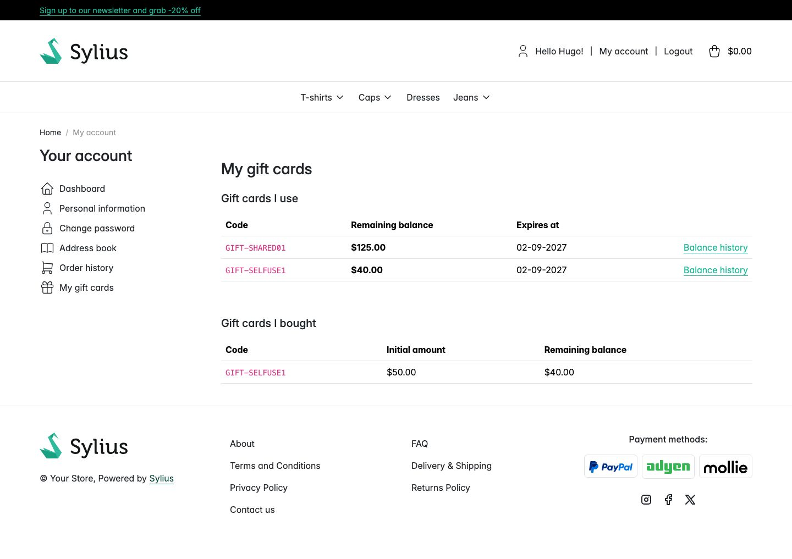

# Journey: see your gift cards and where the balance went

> **Replayed against a running shop on 2 September 2026.** Every screenshot below was taken while
> these steps were carried out, in order. Steps described without a picture were run but not
> photographed.

**Who:** a registered customer holding a gift card.
**Goal:** find the cards you hold, what is left on them, and the history behind it.
**Before you start:** you are signed in. This page is behind a login, and shows only cards you are
linked to.

## 1. Sign in

Open **Login**, fill in **Username** and **Password**, and select **Login**.

## 2. Open My gift cards

Select **My account**, then **My gift cards** in the account menu, below **Order history**.

Cards you spend and cards you bought for others are listed separately.

### Gift cards I use

Listed first, because this is the list with a balance somebody is watching.

| Column | In this capture |
|---|---|
| **Code** | `GIFT-SHARED01`, `GIFT-SELFUSE1` |
| **Remaining balance** | $125.00, $40.00 |
| **Expires at** | 02-09-2027 for both |
| (unlabelled) | A **Balance history** link per row |

A card is in this list because you were the first customer to apply it to an order. Somebody else
may well have paid for it.

### Gift cards I bought

| Column | In this capture |
|---|---|
| **Code** | `GIFT-SELFUSE1` |
| **Initial amount** | $50.00 |
| **Remaining balance** | $40.00 |

A card is in this list because you paid for it. There is no **Balance history** link here: a
purchaser sees the code and the two amounts, not the ledger.

The same card can be in both lists, as `GIFT-SELFUSE1` is here: this customer bought it and then
spent it themselves. $10.00 of its $50.00 has gone.

## 3. Follow Balance history

The link opens the card's own page, which shows:

- the **code** as the heading;
- **Remaining balance**, over the initial amount;
- the **Custom message**, when the card has one, rendered as text;
- **Balance history**: **Date**, **Type** (**Spent** or **Added**), **Amount** with its sign, and
  **Balance after**.

A card that has never moved shows "This gift card has not been used yet." instead of the table.

Unlike the admin's balance history, the customer's version has no **Order** column.

> The card page itself was not captured in this run. The walkthrough stopped at **My gift cards**.

## Why this page matters

The code box on the basket gives the same refusal for every reason a card cannot be used, on
purpose. This page is where the missing detail lives. It is behind a login and scoped to cards that
are actually yours, so it can safely say what the basket cannot: what is left, and when it expires.

## Related

- [My gift cards in the customer account](../features/customer-account.md)
- [Spend a gift card on an order](spend-a-gift-card-on-an-order.md)
- [The email that carries the code](the-gift-card-email.md)
