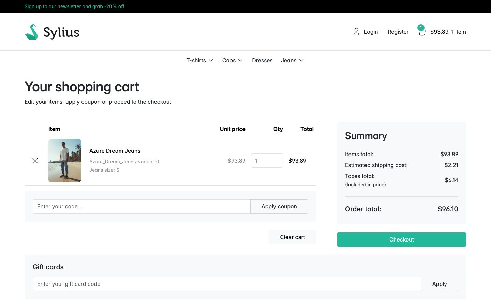
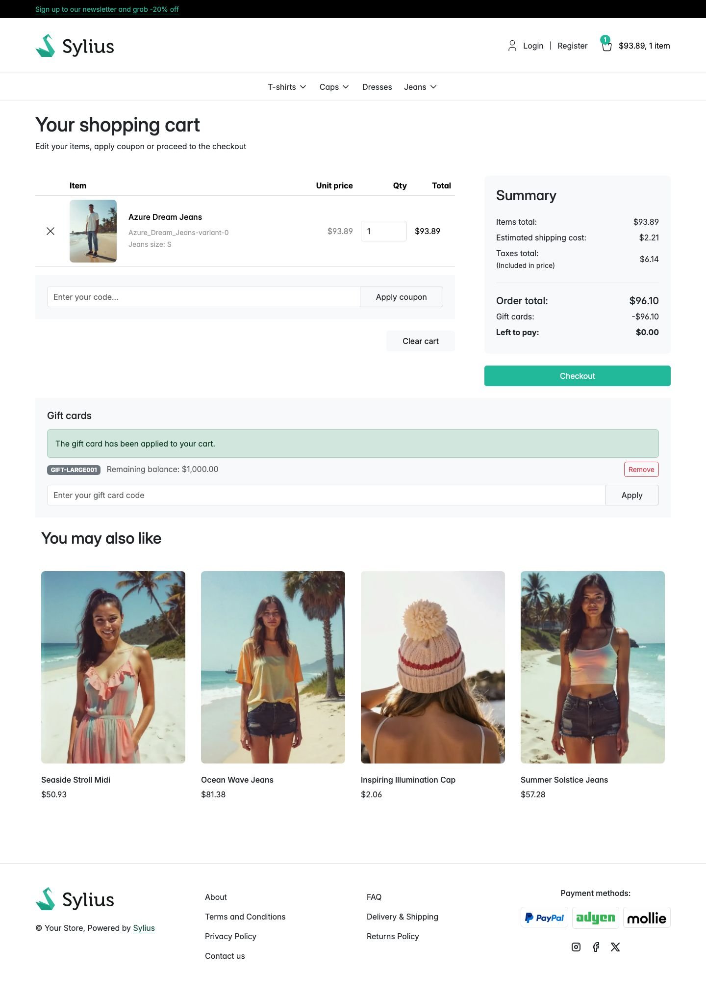

# Journey: spend a gift card on an order

> **Replayed against a running shop on 2 September 2026.** Every screenshot below was taken while
> these steps were carried out, in order. Steps described without a picture were run but not
> photographed.

**Who:** a customer holding a gift card. No account needed.
**Goal:** apply a code to the basket and see what is left to pay.
**Before you start:** the card is enabled, has a balance, has not expired, and belongs to the
channel you are shopping in.

## 1. Add something to the basket

Open a product and select the add-to-cart button. This run used **Azure Dream Jeans** at $93.89.

## 2. Open your basket

The **Gift cards** panel sits below the basket, outside the basket's own form and separate from the
coupon box above it. A coupon changes what the order is worth; a gift card does not. They are
different controls for different things.

The panel only renders when the basket has something in it.

## 3. Enter the code from your gift card

The box is labelled by its placeholder, **Enter your gift card code**. Leading and trailing spaces
are trimmed, so a code pasted with a stray space still works.

## 4. Apply it

Select **Apply**. The panel confirms with "The gift card has been applied to your cart." and lists
the card above the box.

## 5. Read what changed

**The order total does not move. What you pay is what drops.** A gift card is money, not a discount.

In this capture the summary reads:

| Line | Value |
|---|---|
| Items total | $93.89 |
| Estimated shipping cost | $2.21 |
| Taxes total (included in price) | $6.14 |
| **Order total** | **$96.10** |
| **Gift cards** | **-$96.10** |
| **Left to pay** | **$0.00** |

The goods are still worth $96.10. The card covers all of it, so nothing is charged.

The card itself is listed above the code box as **GIFT-LARGE001**, with **Remaining balance:
$1,000.00** and a **Remove** button. That balance is still the full $1,000.00: applying a card to a
basket does not debit it. The money moves when the order is placed.

## Applying more than one card

Repeat from step 3. Cards stack. Each is charged only what is still owed, so a card applied to an
order already covered in full is charged nothing and keeps its whole balance. **Left to pay** never
goes below zero.

## Taking a card back off

Select **Remove** next to it. The basket returns to what it was, and applying the card again costs
nothing: the card has not been debited yet.

## If something goes wrong

| What you see | What it means |
|---|---|
| "Please enter a gift card code." | The box was empty. |
| "A gift card cannot be used to pay for a gift card. Remove the gift card from your basket to pay with your card." | Your basket holds only gift cards. See [Why a gift card will not pay for a gift card](why-a-gift-card-will-not-pay-for-a-gift-card.md). |
| "This gift card code cannot be used. Check it and try again." | Every other refusal: the code does not exist, or the card is expired, disabled, spent out, or belongs to another channel. |
| "Too many gift card codes have been tried from here. Please wait a few minutes before trying again." | Too many failed attempts from this network. Wait out the window; the default is 15 minutes. |

The third message is deliberately the same for every reason. A message that distinguished them would
tell anybody typing codes at random which ones are real. A customer who wants to know why *their*
card will not work signs in and opens
[My gift cards](../features/customer-account.md).

## When the balance actually moves

Not when the card is applied. The balance comes off when the **order is placed**, and goes back on
if the order is **cancelled**, by exactly the amount that was charged.

The first customer to redeem a card is recorded as its **Used by** and is not reassigned afterwards.

## Related

- [Redeeming a gift card](../features/redeeming-a-gift-card.md)
- [Apply a gift card during checkout](apply-a-gift-card-during-checkout.md)
- [See your gift cards and where the balance went](see-your-gift-cards.md)
