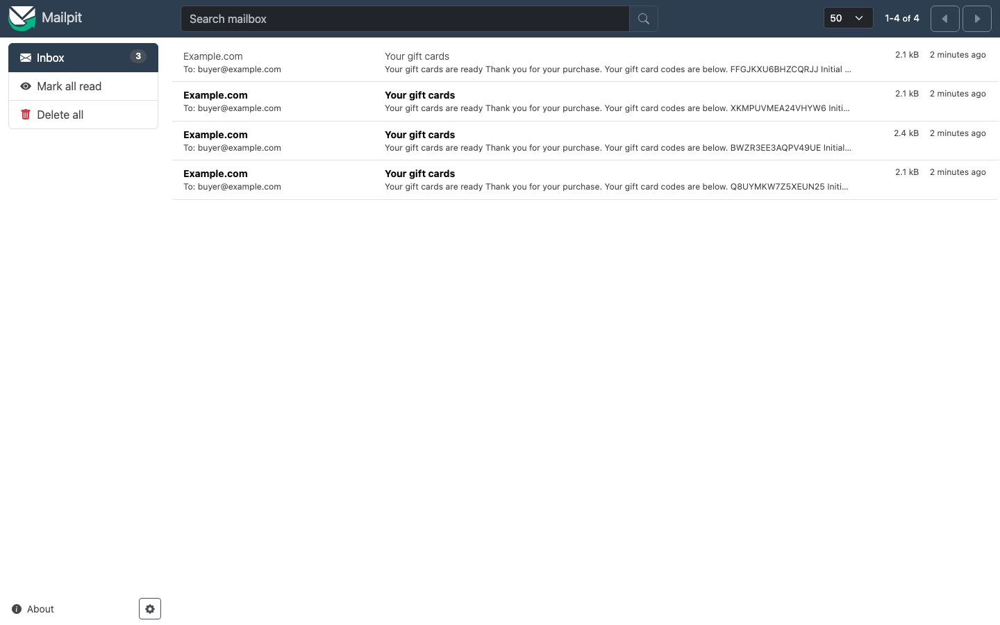
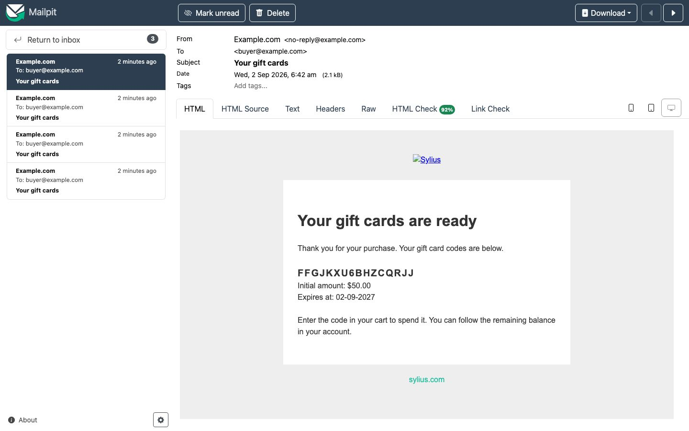

# Journey: the email that carries the code

> **Replayed against a running shop on 2 September 2026.** Every screenshot below was taken while
> these steps were carried out, in order.

**Who:** whoever the card was bought for.
**Goal:** see the email a customer receives, and the code inside it.

A gift card's code is **delivered by email**. Nothing on the confirmation page hands it over, and a
guest who buys a card has no account page to read it from. If that email does not arrive, the
customer has paid for a card they cannot spend.

## Reading the mail in development

In development the **mailpit** container from `compose.yml` catches the mail, so you can read
exactly what the customer gets:

```
docker compose up -d mailpit
```

| Setting | Value |
|---|---|
| SMTP | `127.0.0.1:1025` |
| Web interface | <http://127.0.0.1:8025> |
| `MAILER_DSN` | `smtp://127.0.0.1:1025` |

`tests/TestApplication/.env` points `MAILER_DSN` at that container. Before this, `MAILER_DSN` was
`null://null`: the mail was generated, thrown away, and there was no way to see the one artefact a
customer actually receives. Nothing about the plugin changed, but the code became visible.

Ports are overridable with `MAILPIT_SMTP_PORT` and `MAILPIT_UI_PORT`, and the mailbox is held in
memory with a 500 message cap. It is a development mailbox, not an archive.

> The code in this example carries no prefix. It was issued in a channel with no gift card
> configuration, so the generator used its defaults. A channel that sets a **Code prefix** issues
> codes that begin with it, which is why the cards in the admin screenshots read `GIFT-...`.

## 1. Open the inbox



Each purchase sends one message, subject **Your gift cards**, to whoever bought the cards. The four
here are four separate purchases, each with its own code visible in the preview line.

## 2. Open the message



The message carries the code, what the card is worth, and when it expires:

| Line | In this capture |
|---|---|
| Subject | Your gift cards |
| Heading | Your gift cards are ready |
| Opening | "Thank you for your purchase. Your gift card codes are below." |
| Code | `FFGJKXU6BHZCQRJJ` |
| **Initial amount** | $50.00 |
| **Expires at** | 02-09-2027 |
| Closing | "Enter the code in your cart to spend it. You can follow the remaining balance in your account." |

If the buyer wrote a **Message** on the product page, it is shown with the code. The message is
customer-supplied text and is rendered as text, never as markup.

The code block repeats for every card on the order: one card is issued per purchased unit, so an
order for three gift cards produces one email listing three codes.

## When it is sent

When the **order is paid**, not when it is placed. An unpaid order never hands out spendable codes.

A mail failure does not fail the payment. An order that is paid stays paid, and the codes remain
visible in the buyer's account under
[My gift cards](see-your-gift-cards.md). That is the fallback for a signed-in buyer; a guest has
only the email.

## Changing the email

The email is registered as `madcoders_gift_cards_purchased`. A host application overrides its
subject or its template by redefining that code under `sylius_mailer.emails`. See
[`docs/INSTALLATION.md`](../../INSTALLATION.md).

## Related

- [Buy a gift card as a guest](buy-a-gift-card-as-a-guest.md)
- [Selling gift cards](../features/selling-gift-cards.md#the-emails)
- [See your gift cards and where the balance went](see-your-gift-cards.md)
