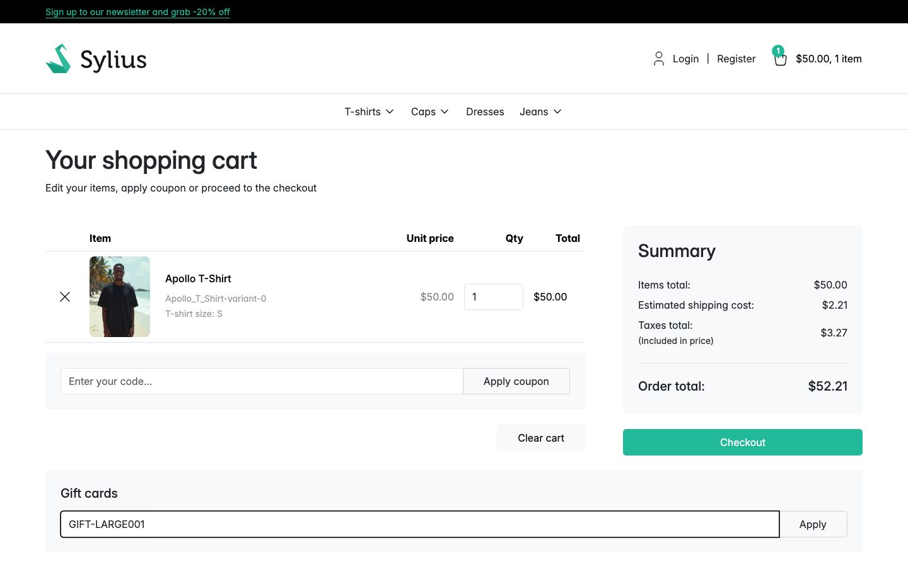
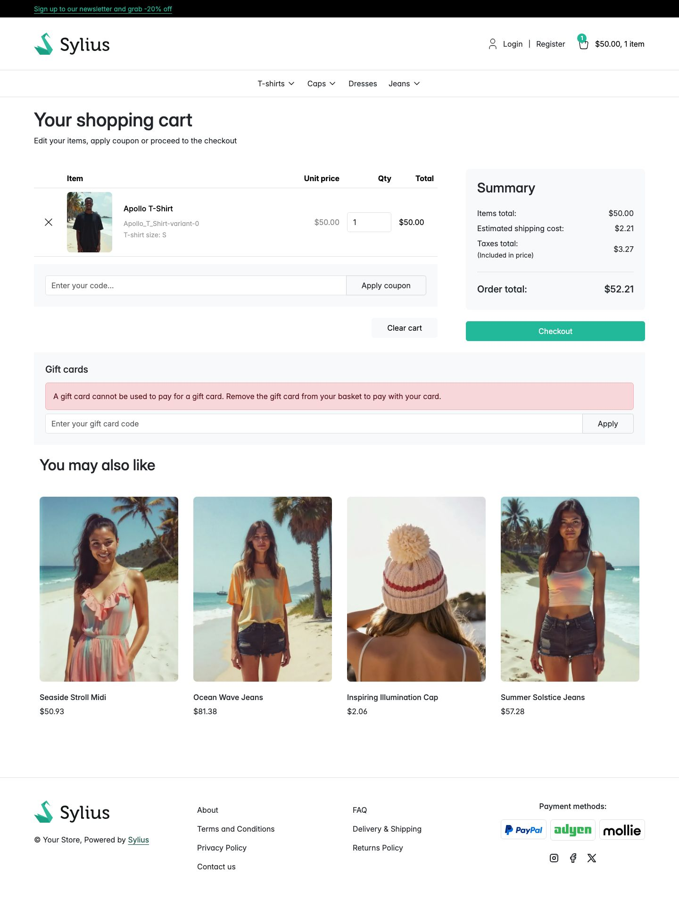

# Journey: why a gift card will not pay for a gift card

> **Replayed against a running shop on 2 September 2026.** Every screenshot below was taken while
> these steps were carried out, in order. Steps described without a picture were run but not
> photographed.

**Who:** a customer trying to roll one card into another.
**Goal:** see the refusal, and understand why it is there.

This is a rule, not a fault. A basket that holds nothing but gift cards cannot be paid for with a
gift card.

## 1. Put a gift card in the basket

Open a gift card product, choose an amount, and add it to the basket. This run chose **$50.00** on
**Apollo T-Shirt**. Your basket now holds nothing but a gift card.

## 2. Try to pay for it with a card you already hold

The **Gift cards** panel is on the page as usual, and the code box accepts typing. Nothing warns you
in advance.

## 3. Apply it

The shop refuses, and says why:

> A gift card cannot be used to pay for a gift card. Remove the gift card from your basket to pay
> with your card.

The summary is untouched: **Order total** is still $52.21 and there is no **Gift cards** line,
because nothing was applied. The code you typed is not consumed and its balance is not touched.

Unlike the general refusal, this message names its reason. It has to: the customer has done nothing
wrong with the code, and telling them "this code cannot be used" would send them chasing a card that
is perfectly good.

## Why the rule exists

Stored value cannot be rolled from one code into another.

- **It would reset the expiry indefinitely.** A card expires. Spending a card about to lapse on a
  fresh card would hand back the same money with a new expiry date, and that could be repeated for
  ever. The balance would never age out, and the shop would carry the liability without limit.
- **It would break the link back to the original buyer.** Every card records who paid for it. A card
  bought with another card is bought by nobody, so the trail from a balance back to a real payment
  is cut, and with it any chance of tracing or refunding it.

## What to do instead

Pay for the gift card with an ordinary payment method, or take the gift card out of the basket and
spend your existing card on the rest of the order.

## A mixed basket is not refused

The refusal is about a basket that holds **only** gift cards, not one that happens to contain one.

Put goods and a gift card in the same basket and a code is accepted. What it may cover is the order
total **less what the gift card lines are worth**. Shipping stays coverable, on the reasoning that
the postage is for the goods; a gift card is emailed. An all-gift-card basket has no goods, so there
is no postage to justify either, and nothing at all is settleable, which is why the code is refused
outright rather than accepted for a few pounds of delivery.

## For operators: the channel setting behind this

The rule is a channel setting, **What a gift card pays for**, on the
[gift card configuration](../features/gift-card-configuration.md):

| Choice | Effect |
|---|---|
| **Everything except gift cards** | The default, and what this walkthrough shows. |
| **Anything, gift cards included** | The refusal never appears; a card may settle gift card lines too. |

Its help text is blunt about the cost: "Whether a gift card may be spent on another gift card.
Allowing it lets a holder roll one card into the next indefinitely, which makes the expiry date
unenforceable."

A channel with no configuration at all gets the safe choice, not the permissive one.

## Related

- [Spend a gift card on an order](spend-a-gift-card-on-an-order.md)
- [Redeeming a gift card](../features/redeeming-a-gift-card.md)
- [Buy a gift card as a guest](buy-a-gift-card-as-a-guest.md)
