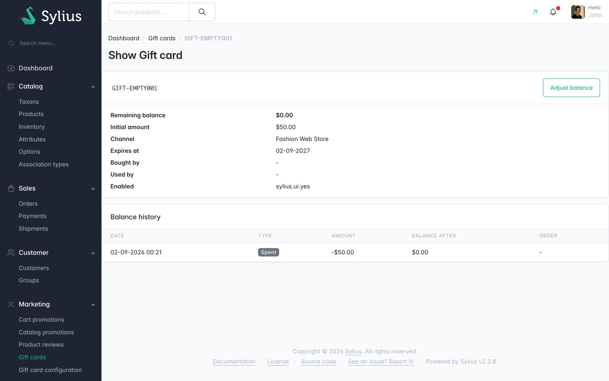

# Empty states

What each of the plugin's screens shows when there is nothing to show.

## A gift card that has never been used

**Where:** the **Balance history** panel on a card's page in the admin, and on the card's page in
**My gift cards**.

**Text:** "This gift card has not been used yet."

The table is replaced entirely, not rendered with zero rows.

Captured page: `GIFT-FULL0001`, a card with its full $100.00 balance and no movements.

This is the normal state for a card an administrator has just issued, and for a bought card the
recipient has not spent yet.

## No gift cards the customer uses

**Where:** the **Gift cards I use** section of **My gift cards** in the customer account.

**Text:** "You are not using any gift cards yet."

Not captured by the crawl; read from the template.

## No gift cards the customer bought

**Where:** the **Gift cards I bought** section of **My gift cards**.

**Text:** "You have not bought any gift cards."

Not captured by the crawl; read from the template.

## An empty basket

**Where:** the cart page and the checkout sidebar.

**There is no empty state, because there is no panel.** The gift card panel is not rendered at all
when the order is empty. A customer with nothing in their basket has nowhere to type a code, and no
message explaining why.

Not captured by the crawl; read from the templates, which guard on `not cart.empty` and
`not order.empty`.

## A gift card with no expiry

**Where:** the **Expires at** column in the admin list, the **Expires at** row on a card's page, and
the customer's **Gift cards I use** list.

**Text:** "Never", in muted grey.

Visible in the captured list screenshot on the `GIFT-NOEXPIRY` row.

## A gift card with no customer links

**Where:** the **Bought by** and **Used by** columns and rows.

**Text:** `-`, in muted grey.

A card issued by an administrator has neither link until somebody spends it. Visible on most rows of
the captured list screenshot.

## A gift card spent out

**Where:** the **Remaining balance** column.

Not an empty state as such, but rendered differently: a balance of zero is greyed out rather than
shown in the normal emphasis. Visible on the `GIFT-EMPTY001` row of the captured list screenshot,
and on that card's page.

## Empty grids

The **Gift cards** and **Gift card configuration** grids use Sylius' own grid rendering, so an empty
one shows Sylius' standard empty message rather than anything the plugin defines. Neither grid was
empty when the crawl ran, so this guide has no capture of that state.
